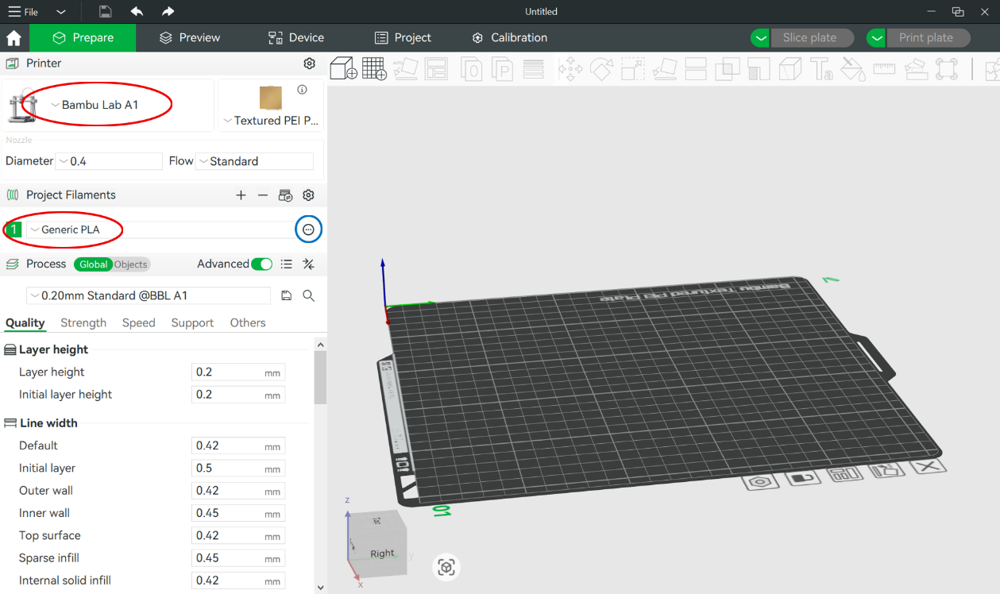
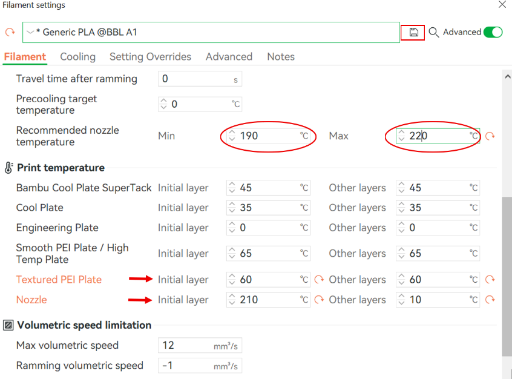
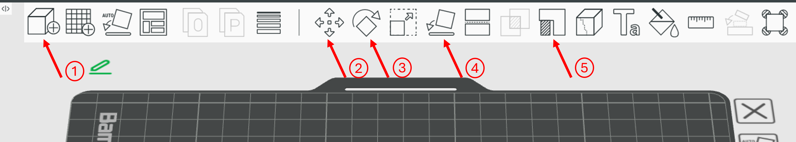

# How to use the 3D printers in the lab.
---
Please read the instructions carefully and stick to the usage rules.

## General Guidlines
1. **Induction before use:**
First time users need to get an introduction by Ali K. who is the responsible person for the printers. Master students must first obtain approval from their supervisor.

1. **Clearance Requirements:**
As observed in the lab, the Bambu Lab A1 printer requires sufficient clearance to operate properly due to the movement of the print bed. Please ensure a minimum of 10 cm of space on the left side and 20 cm on the right side of the printer at all times. These areas have been clearly marked on the shelf. Kindly avoid placing any items within this designated space.

1. **Print Logging:**
To keep track of printer usage, please post the estimated or actual print duration along with the material used in the 3D Printing channel on Microsoft Teams, using the following format:
**BL-[Material]-[Duration]**. For example, a four-hour print using PLA should be posted as: BL-PLA-4hrs.

1. **Notify Changing Filament:**  
To help track our filament supply and usage, please post any filament changes in the 3D Printing channel on Microsoft Teams. Simply write the name of the previous filament and the new one.

1. **Removing Printed Parts:**
When removing your print from the bed, do not scrape or use excessive force. PLA prints, in particular, should detach easily. If needed, gently remove the bed plate and flex it slightly to release the part.

1. **Post-Print Clean-Up:**
After removing your part, please clean the bed plate by discarding any leftover filament pieces in the trash bin. Do not leave any debris around the printer area.

1. **Reporting Issues:**
If the printer encounters any issues during operation, please notify me immediately. You may contact me via email [akeramati@student.unimelb.edu.au] or through Microsoft Teams.

## List of Printers
| |Printer|Printable Materials|Responsible Person
|-|-------|-------------------|------------------
||[Bambu Lab A1](#Bambu-Lab-A1)|TPU and PLA|Ali K
||[Prusa Core One](#Prusa-Core-One)|TPU|Ali K

## Bambu Lab A1 (BL)
This printer can be used for printing PLA or TPU. 

* Material left Nozzle: TPU 1.75mm 
* Material right Nozzle:PLA 1.75mm 
* Nozzle: 0.4mm
* Recommended
* Printable Volume: 256 x 256 x 256 mm
  
### Loading and Unloading Filament
    
1. To load filament into the printer, first place the filament spool into the filament dryer. After guiding the filament through the dryer's designated exit, gently push it through the transparent tube ,attached to the printer, until it reaches the extruder.

    
1. On the printer's touchscreen, select **Filament**, then choose **Load Filament**. You will be prompted to specify the filament type—select either PLA or TPU, depending on what you are using.

    
1. For PLA, you can select the specific manufacturer from the available list. Currently, we have **Esun PLA+**, which appears in the list and should be selected when loading that filament. However, filaments such as **FlashForge PLA** are not listed by name, so in those cases, please select **Generic PLA**. Similarly, for TPU filaments, use the **Generic TPU** option.
 
    
    
1. Allow the nozzle to heat up. Once the printer displays a message prompting you to check the nozzle, observe whether the previous filament is being purged. At this stage, gently pull the filament to ensure there is resistance, indicating successful loading. If confirmed, close the message and return to the home screen.

    
1. For unloading, the process is more straightforward. Select **Filament** on the screen, then choose **Unload**. Wait for the nozzle to heat up, and follow the on-screen instruction to pull out the filament. After removing the filament, close the message and return to the home screen.

    
1. If you require assistance or are not confident in performing filament loading or unloading, please do not hesitate to contact me.

### Slicer environment
   
1. Please begin by installing the dedicated slicer software for Bambu Lab printers, which can be downloaded from the following link: [https://bambulab.com/en-au/download/studio].

    
1. Once the installation is complete, select **Bambu Lab A1** as the designated printer.
    
1. Next, click on the **"Prepare"** tab located at the top left corner of the screen. This will display the printing settings, as shown in Figure 1.
    
1. If you did not select the correct printer during the initial setup, you may update the selection at this stage. The option to change the printer is located in the top left section of Figure 1.
    
1. The default **print bed plate** is the **Textured PEI Plate**. Please ensure this is selected unless a specific print requires a different surface. For printing with TPU, we use a different build plate — the **Smooth PEI Plate** — which facilitates easier removal of the printed parts from the bed upon completion.

1. The printer is currently equipped with a **standard 0.4 mm nozzle**. This setting should remain unchanged unless otherwise specified for particular printing needs.

*Figure 1: Bambu Studio user interface*

### Filament Setting and Model Preparation

    
1. In the slicer, under the **Project Filaments** tab, you may select the type of filament you wish to use. The recommended settings for the filaments available in the lab are attached to this document. Below is a guide on how to configure the parameters for **FlashForge PLA**:
    
    
1. For **FlashForge PLA**, go to the **Project Filaments** section and select **Generic PLA** from the list. Then, click the three dots located to the right of the filament’s name (highlighted with a blue circle in Figure 2).
    
    
1. Scroll down to the **Recommended Nozzle Temperature** section and set the minimum to 190°C and the maximum to 220°C, as shown in Figure 2.
    
    
1. Additional parameters that need to be adjusted include the **plate temperature** and **nozzle temperature**, both for the **initial layer** and **other layers**. Set the plate temperature to $60^$C and the nozzle temperature to $210^$C, as illustrated in Figure 2.
    
    
1. Leave the remaining settings at their default values. Once all adjustments are complete, save the preset by clicking the save icon next to the filament name (indicated by the red rectangle in Figure 2). Before saving, rename the filament profile to  for future reference.
   

*Figure 2: Bambu Studio filament setting* 
    
    
6. To add your STL file to the workspace, click on the first icon in the top left corner, which displays the print bed (highlighted in Figure 3). The additional icons in this tab allow you to adjust the position and orientation of your model on the print bed. Hover your cursor over each icon to see a description of its function. To activate the adjustment options, simply click on the imported model.
    
        
    
7. Next, go to the **Process Settings** section, located in the lower left corner of the screen. Most settings under the **Quality** and **Speed** categories can remain at their default values. In the **Strength** section, you may adjust the **Sparse Infill Density** and **Sparse Infill Pattern** if necessary. However, the default settings are typically sufficient unless specific mechanical properties are needed.
    
    
8. To add **supports**, you can choose between **automatic** and **manual** support generation. For each method, you can select either **normal** or **tree-shaped** supports. These will be visualized in the sliced preview after clicking the **Slice Plate** button in the bottom right corner of the screen.

    
9. After enabling supports in the **Process settings**, you can apply manual supports by specifying the areas where support is needed using the **Support Painting** tool, located on the top taskbar, as shown in Figure 3. Simply paint the surfaces that require support.  
 

*Figure 3: Bambu Studio task bar: 1) adding STL file, 2) moving the part on the bed plate 3)
Rotating the part along its axes, 4) choosing a surface to place it on the bed, and 5) support
painting (only for manual support)*      

10. Once satisfied with the sliced preview, export the G-code by clicking the **Export Plate Sliced File** button, located next to the **Slice Plate** icon. Save the resulting file to your computer.
    
    
11. Power on the printer using the button located on the right side of the device (note: although this is technically the back of the printer, due to its orientation on the shelf, it appears on the right side).
    
    
12. Transfer the exported G-code file to the printer’s SD card and reinsert the card into the printer. On the printer’s touchscreen interface, select **Print Files**. The most recently added file should appear at the top of the list. Select your file and allow the printer to begin the printing process.

   
## Prusa Core One (CO)
This printer can be used for printing TPU.

* Material: TPU 1.75mm 
* Nozzle: 0.4mm
* Printable Volume: 

## Slicer Setting for each filament types
Pleas check the example [folder](./Filament_settings).

